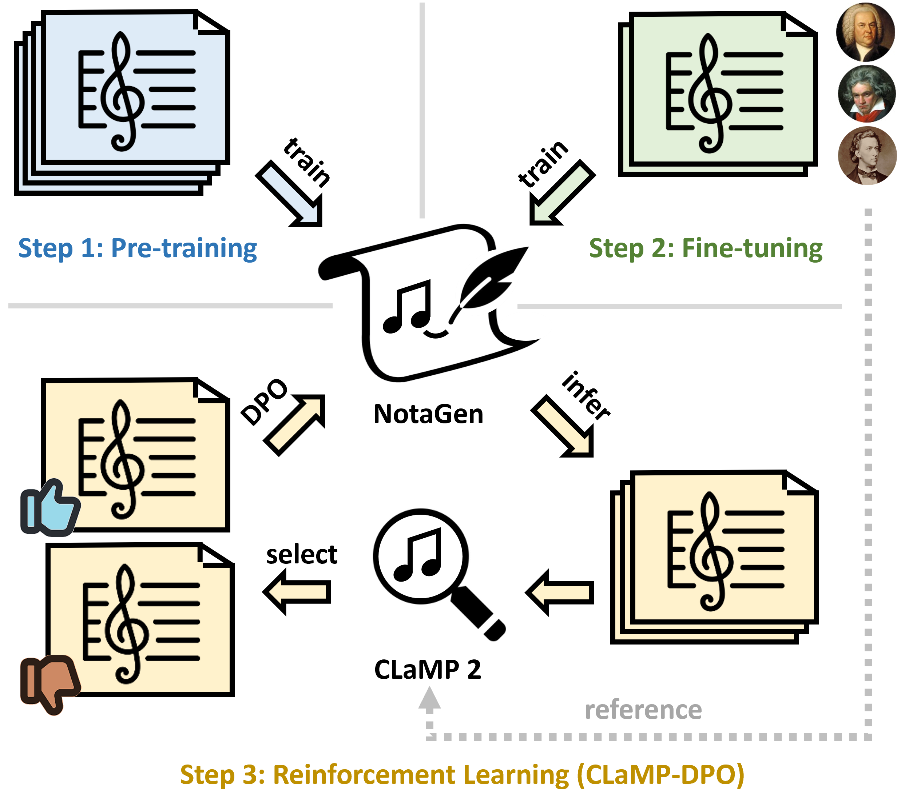

# 🎵 NotaGen: Advancing Musicality in Symbolic Music Generation with Large Language Model Training Paradigms

[](https://arxiv.org/abs/XXXX.XXXXX)  [](https://huggingface.co/ElectricOnes/NotaGen)  [](https://electricalexis.github.io/notagen-demo/)

<p align="center">
  
</p>


## 📖 Overview
**NotaGen** is a symbolic music generation model that explores the potential of producing **high-quality classical sheet music**. Inspired by the success of Large Language Models (LLMs), NotaGen adopts a three-stage training paradigm:
- 🧠 **Pre-training** on 1.6M musical pieces
- 🎯 **Fine-tuning** on ~9K classical compositions with `period-composer-instrumentation` prompts
- 🚀 **Reinforcement Learning** using our novel **CLaMP-DPO** method (no human annotations or pre-defined rewards required.)

## ⚙️ Environment Setup

```bash
conda create --name notagen python=3.10
conda activate notagen
conda install pytorch==2.3.0 pytorch-cuda=11.8 -c pytorch -c nvidia
pip install accelerate
pip install optimum
pip install -r requirements.txt
```

## 🏋️ NotaGen Model Weights

### Pre-training
We provide pre-trained weights of different scales:
|  Models         |  Parameters  |  Patch-level Decoder Layers  |  Character-level Decoder Layers  |  Hidden Size  |  Patch Length (Context Length)  |
|  ----           |  ----  |  ---- |  ----  |  ----  |  ----  |
|  [NotaGen-small](https://huggingface.co/ElectricOnes/NotaGen/blob/main/weights_notagen_pretrain_p_size_16_p_length_2048_p_layers_12_c_layers_3_h_size_768_lr_0.0002_batch_8.pth)  | 110M   |  12   |  3     |  768   |  2048  |
|  [NotaGen-medium](https://huggingface.co/ElectricOnes/NotaGen/blob/main/weights_notagen_pretrain_p_size_16_p_length_2048_p_layers_16_c_layers_3_h_size_1024_lr_0.0001_batch_4.pth) | 244M   |  16   |  3     |  1024  |  2048  |
|  [NotaGen-large](https://huggingface.co/ElectricOnes/NotaGen/blob/main/weights_notagen_pretrain_p_size_16_p_length_1024_p_layers_20_c_layers_6_h_size_1280_lr_0.0001_batch_4.pth)  | 516M   |  20   |  6     |  1280  |  1024  |

### Fine-tuning

We fine-tuned NotaGen-large on a corpus of approximately 9k classical pieces. You can download the weights [here](https://huggingface.co/ElectricOnes/NotaGen/blob/main/weights_notagen_pretrain-finetune_p_size_16_p_length_1024_p_layers_c_layers_6_20_h_size_1280_lr_1e-05_batch_1.pth).

### Reinforcement-Learning

After pre-training and fine-tuning, we optimized NotaGen-large with 3 iterations of CLaMP-DPO. You can download the weights [here](https://huggingface.co/ElectricOnes/NotaGen/blob/main/weights_notagen_pretrain-finetune-RL3_beta_0.1_lambda_10_p_size_16_p_length_1024_p_layers_20_c_layers_6_h_size_1280_lr_1e-06_batch_1.pth).

### 🌟 NotaGen-X

Inspired by Deepseek-R1, we further optimized the training procedures of NotaGen and released a better version --- [NotaGen-X](https://huggingface.co/ElectricOnes/NotaGen/blob/main/weights_notagenx_p_size_16_p_length_1024_p_layers_20_h_size_1280.pth). Compared to the version in the paper, NotaGen-X incorporates the following improvements:

- We introduced a post-training stage between pre-training and fine-tuning, refining the model with a classical-style subset of the pre-training dataset.
- We removed the key augmentation in the Fine-tune stage, making the instrument range of the generated compositions more reasonable.
- After RL, we utilized the resulting checkpoint to gather a new set of post-training data. Starting from the pre-trained checkpoint, we conducted another round of post-training, fine-tuning, and reinforcement learning.


## 🎹 Local Gradio Demo

We developed a local Gradio demo for NotaGen-X. You can input **"Period-Composer-Instrumentation"** as the prompt to have NotaGen generate music！

<p align="center">
  
</p>

Deploying NotaGen-X inference locally requires at least 40GB of GPU memory. For implementation details, please view [gradio/README.md](https://github.com/ElectricAlexis/NotaGen/blob/main/gradio/README.md). We are also working on developing an online demo.


## 🛠️ Data Pre-processing & Post-processing

For converting **ABC notation** files from / to **MusicXML** files, please view [data/README.md](https://github.com/ElectricAlexis/NotaGen/blob/main/data/README.md) for instructions.

To illustrate the specific data format, we provide a small dataset of **Schubert's lieder** compositions from the [OpenScore Lieder](https://github.com/OpenScore/Lieder), which includes:
- 🗂️ Interleaved ABC folders
- 🗂️ Augmented ABC folders
- 📄 Data index files for training and evaluation

You can download it [here](https://drive.google.com/drive/folders/1iVLkcywzXGcHFodce9nDQyEmK4UDmBtY?usp=sharing) and put it under ```data/```.

In the instructions of **Fine-tuning** and **Reinforcement Learning** below, we will use this dataset as an example of our implementation. **It won't include the "period-composer-instrumentation" conditioning**, just for showing how to adapt the pretrained NotaGen to a specific music style.


## 🧠 Pre-train
If you want to use your own data to pre-train a blank **NotaGen** model, please:
1. Preprocess the data and generate the data index files following the instructions in [data/README.md](https://github.com/ElectricAlexis/NotaGen/blob/main/data/README.md)
2. Modify the parameters in ```pretrain/config.py```

Use this command for pre-training:
```bash
cd pretrain/
accelerate launch --multi_gpu --mixed_precision fp16 train-gen.py
```

## 🎯 Fine-tune

Here we give an example on fine-tuning **NotaGen-large** with the **Schubert's lieder** data mentioned above.

**Notice:** The use of **NotaGen-large** requires at least **40GB of GPU memory** for training and inference. Alternatively, you may use **NotaGen-small** or **NotaGen-medium** and change the configuration of models in ```finetune/config.py```.

### Configuration
- In ```finetune/config.py```:
  - Modify the ```DATA_TRAIN_INDEX_PATH``` and ```DATA_EVAL_INDEX_PATH```:
    ```python
    # Configuration for the data
    DATA_TRAIN_INDEX_PATH = "../data/schubert_augmented_train.jsonl" 
    DATA_EVAL_INDEX_PATH  = "../data/schubert_augmented_eval.jsonl"
    ```
  - Modify the ```PRETRAINED_PATH``` to the pre-trained NotaGen weights:
    ```python
    PRETRAINED_PATH = "../pretrain/weights_notagen_pretrain_p_size_16_p_length_1024_p_layers_20_c_layers_6_h_size_1280_lr_0.0001_batch_4.pth"  # Use NotaGen-large
    ```
  - ```EXP_TAG``` is for differentiating the models. It will be integrated into the ckpt's name. Here we set it to ```schubert```.
  - You can also modify other parameters like the learning rate.

### Execution
Use this command for fine-tuning:
```bash
cd finetune/
CUDA_VISIBLE_DEVICES=0 python train-gen.py
```

## 🚀 Reinforcement Learning (CLaMP-DPO)

Here we give an example on how to use **CLaMP-DPO** to enhance the model fine-tuned with **Schubert's lieder** data.

### ⚙️ CLaMP 2 Setup

Download model weights and put them under the ```clamp2/```folder:
- [CLaMP 2 Model Weights](https://huggingface.co/sander-wood/clamp2/blob/main/weights_clamp2_h_size_768_lr_5e-05_batch_128_scale_1_t_length_128_t_model_FacebookAI_xlm-roberta-base_t_dropout_True_m3_True.pth)
- [M3 Model Weights](https://huggingface.co/sander-wood/clamp2/blob/main/weights_m3_p_size_64_p_length_512_t_layers_3_p_layers_12_h_size_768_lr_0.0001_batch_16_mask_0.45.pth)

### 🔍 Extract Ground Truth Features
Modify ```input_dir``` and ```output_dir``` in ```clamp2/extract_clamp2.py```:
```python
input_dir = '../data/schubert_interleaved'  # interleaved abc folder
output_dir = 'feature/schubert_interleaved'  # feature folder
```
Extract the features:
```
cd clamp2/
python extract_clamp2.py
```

### 🔄 CLaMP-DPO

Here we give an example of an iteration of **CLaMP-DPO** from the initial model fine-tuned on **Schubert's lieder** data.

#### 1. Inference
- Modify the ```INFERENCE_WEIGHTS_PATH``` to path of the fine-tuned weights and ```NUM_SAMPLES``` to generate in ```inference/config.py```:
  ```python
    INFERENCE_WEIGHTS_PATH = '../finetune/weights_notagen_schubert_p_size_16_p_length_1024_p_layers_20_c_layers_6_h_size_1280_lr_1e-05_batch_1.pth'              
    NUM_SAMPLES = 1000                                               
  ```
- Inference:
  ```
  cd inference/
  python inference.py
  ```
  This will generate an ```output/```folder with two subfolders: ```original``` and ```interleaved```. The ```original/``` subdirectory stores the raw inference outputs from the model, while the ```interleaved/``` subdirectory contains data post-processed with rest measure completion, compatible with CLaMP 2. Each of these subdirectories will contain a model-specific folder, named as a combination of the model's name and its sampling parameters.

#### 2. Extract Generated Data Features

Modify ```input_dir``` and ```output_dir``` in ```clamp2/extract_clamp2.py```:
```python
input_dir = '../output/interleaved/weights_notagen_schubert_p_size_16_p_length_1024_p_layers_20_c_layers_6_h_size_1280_lr_1e-05_batch_1_k_9_p_0.9_temp_1.2'  # interleaved abc folder
output_dir = 'feature/weights_notagen_schubert_p_size_16_p_length_1024_p_layers_20_c_layers_6_h_size_1280_lr_1e-05_batch_1_k_9_p_0.9_temp_1.2'  # feature folder
```
Extract the features:
```
cd clamp2/
python extract_clamp2.py
```

#### 3. Statistics on Averge CLaMP 2 Score (Optional)
If you're interested in the **Average CLaMP 2 Score** of the current model, modify the parameters in ```clamp2/statistics.py```:
```python
gt_feature_folder = 'feature/schubert_interleaved'
output_feature_folder = 'feature/weights_notagen_schubert_p_size_16_p_length_1024_p_layers_20_c_layers_6_h_size_1280_lr_1e-05_batch_1_k_9_p_0.9_temp_1.2'
```
Then run this script:
```
cd clamp2/
python statistics.py
```

#### 4. Construct Preference Data
Modify the parameters in ```RL/data.py```:
```python
gt_feature_folder = '../clamp2/feature/schubert_interleaved'
output_feature_folder = '../clamp2/feature/weights_notagen_schubert_p_size_16_p_length_1024_p_layers_20_c_layers_6_h_size_1280_lr_1e-05_batch_1_k_9_p_0.9_temp_1.2'
output_original_abc_folder = '../output/original/weights_notagen_schubert_p_size_16_p_length_1024_p_layers_20_c_layers_6_h_size_1280_lr_1e-05_batch_1_k_9_p_0.9_temp_1.2'
output_interleaved_abc_folder = '../output/interleaved/weights_notagen_schubert_p_size_16_p_length_1024_p_layers_20_c_layers_6_h_size_1280_lr_1e-05_batch_1_k_9_p_0.9_temp_1.2'
data_index_path = 'schubert_RL1.json'  # Data for the first iteration of RL
data_select_portion = 0.1              
```
In this script, the **CLaMP 2 Score** of each generated piece will be calculated and sorted. The portion of data in the chosen and rejected sets is determined by ```data_select_portion```. Additionally, there are also three rules to exclude problematic sheets from the chosen set: 
- Sheets with duration alignment problems are excluded; 
- Sheets that may plagiarize from ground truth data (similarity>0.95) are excluded; 
- Sheets where staves for the same instrument are not grouped together are excluded.

The prefence data file will be names as ```data_index_path```, which records the file paths in chosen and rejected sets.

Run this script:
```
cd RL/
python data.py
```

#### 5. DPO Training

Modify the parameters in ```RL/config.py```:
```python
DATA_INDEX_PATH = 'schubert_RL1.json'  # Preference data path
PRETRAINED_PATH = '../finetune/weights_notagen_schubert_p_size_16_p_length_1024_p_layers_20_c_layers_6_h_size_1280_lr_1e-05_batch_1.pth'  # The model to go through DPO optimization
EXP_TAG = 'schubert-RL1'              # Model tag for differentiation
```
You can also modify other parameters like ```OPTIMATION_STEPS``` and DPO hyper-parameters.

Run this script:
```
cd RL/
CUDA_VISIBLE_DEVICES=0 python train.py
```
After training, a model named ```weights_notagen_schubert-RL1_beta_0.1_lambda_10_p_size_16_p_length_1024_p_layers_20_c_layers_6_h_size_1280_lr_1e-06.pth``` will be saved under ```RL/```. For the second round of CLaMP-DPO, please go back to the first inference stage, and let the new model to generate pieces.

For this small experiment on **Schubert's lieder** data, we post our **Average CLaMP 2 Score** here for the fine-tuned model and models after each iteration of CLaMP-DPO, as a reference:

|  CLaMP-DPO Iteration (K) |  Average CLaMP 2 Score  | 
|  ----           |  ----  | 
|  0 (fine-tuned) | 0.324  |  
|  1              | 0.579  |
|  2              | 0.778  |

If you are interested in this method, have a try on your own style-specific dataset :D

## 📚 Citation

If you find **NotaGen** or **CLaMP-DPO** useful in your work, please cite our paper.

## 🔗 Links
- [CLaMP 2 Paper](https://arxiv.org/pdf/2410.13267)
- [CLaMP 2 Code](https://github.com/sanderwood/clamp2)
