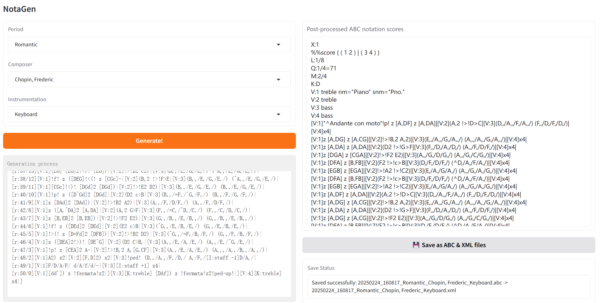

## Local Gradio Demo

1. Set up the environment:

  ```
  conda create --name notagen python=3.10
  conda activate notagen
  conda install pytorch==2.3.0 pytorch-cuda=11.8 -c pytorch -c nvidia
  pip install accelerate
  pip install optimum
  pip install -r requirements.txt
  ```

2. Download [NotaGen-X](https://huggingface.co/ElectricAlexis/NotaGen/blob/main/weights_notagenx_p_size_16_p_length_1024_p_layers_20_h_size_1280.pth) and put it under ```gradio/```.

3. run ```demo.py```:

  ```
  cd gradio/
  python demo.py
  ```

4. Then you can view the demo page at 0.0.0.0:7861.

  <p align="center">
  
  </p>
  
  You can choose period, composer, and instrumentation as a prompt combination for NotaGen's conditional generation. After generation completes, you can save the ABC notation and MusicXML files locally.
  
  It is with some regret that the current combination of prompts is limited to 112, which is constrained by the number of pieces of music under each prompt in the fine-tuning dataset. We hope to expand the combinations and forms of prompts in the future.
